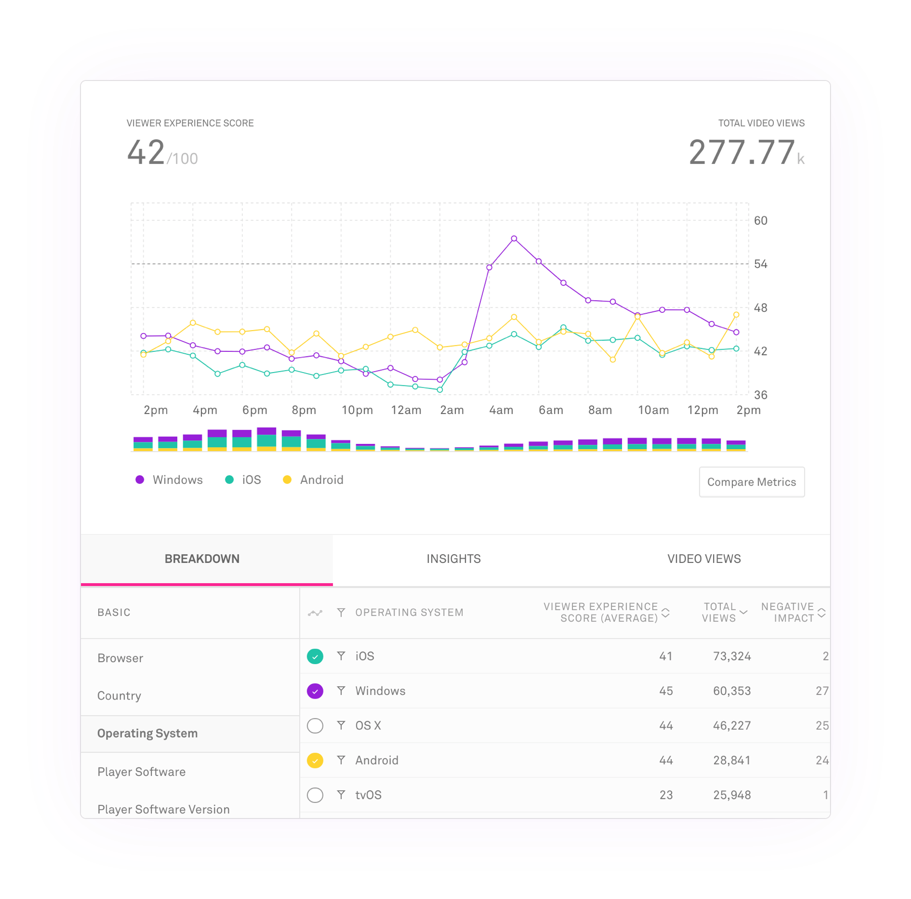
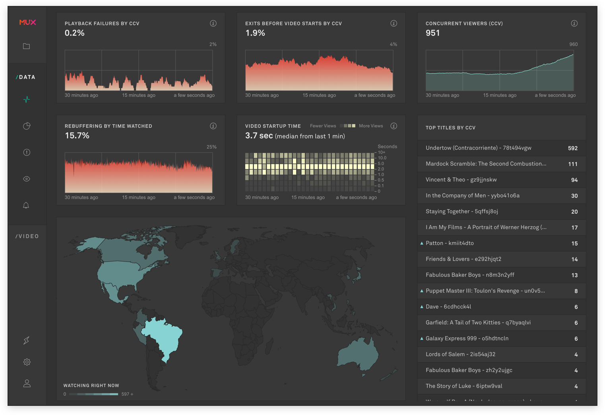

# NexPlayer Mux Data

NexPlayer has integrated a new feature in Android, iOS & HTML5 Player SDKs that allows to analize the viewers broadcast-quality experience.
With the Mux quality of experience data you can improve your video streaming and exceed viewer expectations.

## How does it work?

Mux Data uncovers four key dimensions of video quality of service: playback failures, startup time, rebuffering, and video quality. If your aim is broadcast-quality video streaming, Mux Data enables you to monitor these critical video metrics.

With each Mux Data metric, you can monitor and track what matters to your viewers. For example, Overall Viewer Experience Score is a metric that quickly summarizes your video platform's performance.

## Mux Data Dashboard

The Mux Data Dashboard is an interface that lets you set filters and view graphs that monitor each specific key metric you are interested in. With each metric, you can monitor and track what matters to your viewers.

You can also immediately see what is happening before users do with Anomoly Alerts and Threshold Alerts. It is easy to set these alerts for prompt notifications. Check your dashboard to track the source or sources.

## Mux Real-Time Dashboard

The Mux Data Real-Time Dashboard allows you to see your critical metrics in one real-time dashboard. This lets you respond to major streaming issues quickly.

## What counts as a view?

A "view" in Mux Data is any attempt (successful or not) to view a video. If the user taps play, the video starts to load and fails, that counts as a single view. If a user taps play, starts watching the video, pauses, then resumes that counts as a single view.

If you are seeing more views than expected in your dashboard or what appear to be duplicate views check on the code that initializes the Mux Data SDK to make sure you are initializing it once per playback attempt.

## How is total watch time calculated?

Watch Time is the cumulative amount of time the user spent watching or attempting to watch the video. This metric includes actively playing content, rebuffering, seeking, etc.

If user watches for 90 seconds, has 4 seconds of rebuffering, pauses for 20 seconds, spends 2 seconds seeking by rewinding and then watches 60 more seconds that would total 176 seconds of watch time (90 + 4 + 20 + 2 + 60).

[More information about Mux Data metric definitions](https://docs.mux.com/guides/data/understand-metric-definitions)

